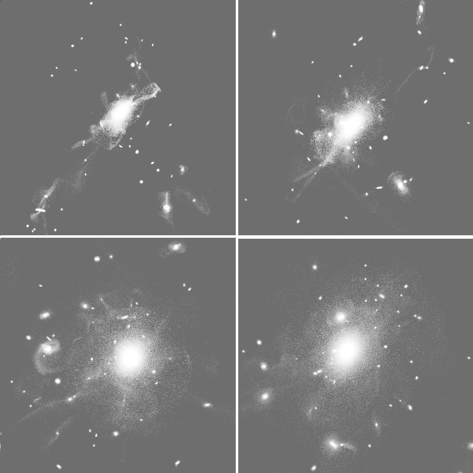
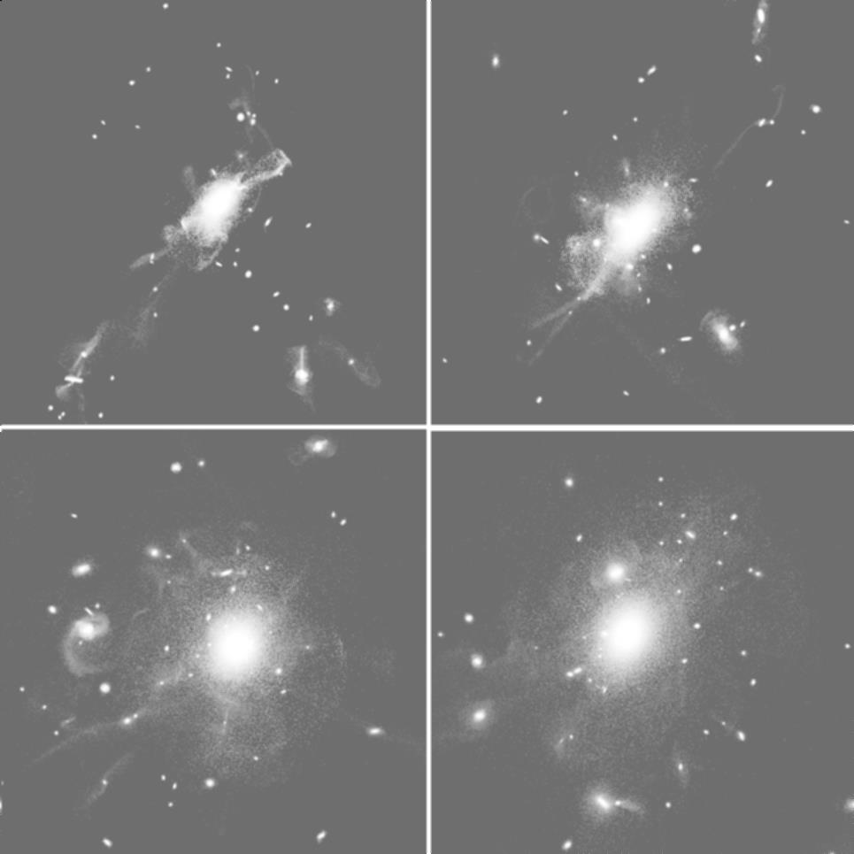
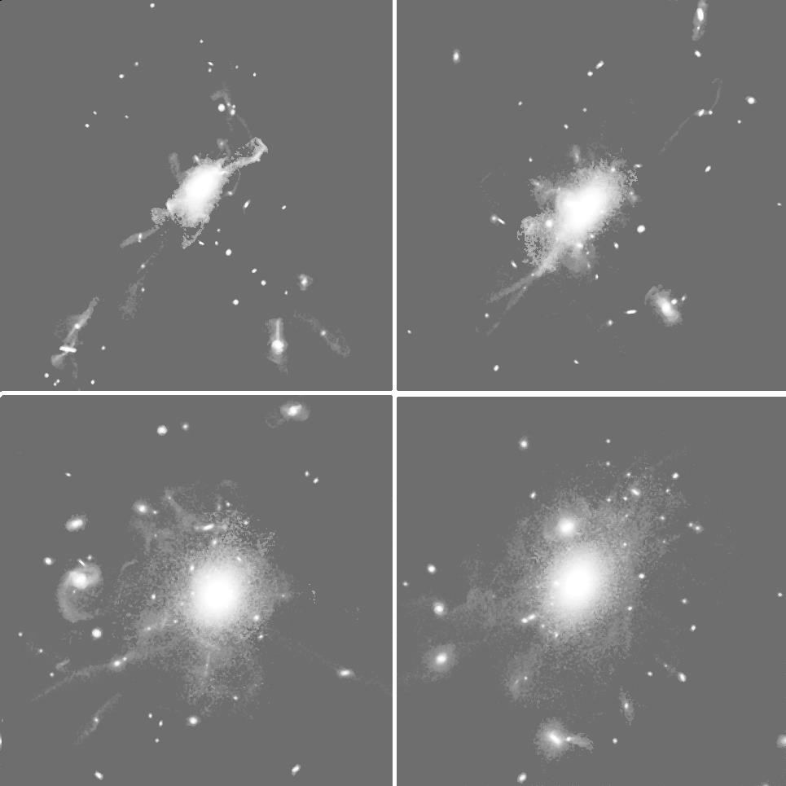
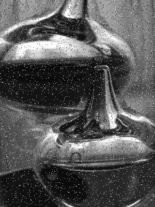

balloonsNpgm.pgm  
  
balloons_average_3.pgm  
  
balloons_median_3.pgm  
  
galaxy.pgm  
  
galaxy_average_3.pgm  
  
galaxy_median_3.pgm  
  
glassN.pgm  
  
glass_average_3.pgm  
  
glass_median_3.pgm  
  
lenaN.pgm  
  
lena_average_3.pgm  
  
lena_median_3.pgm  
  